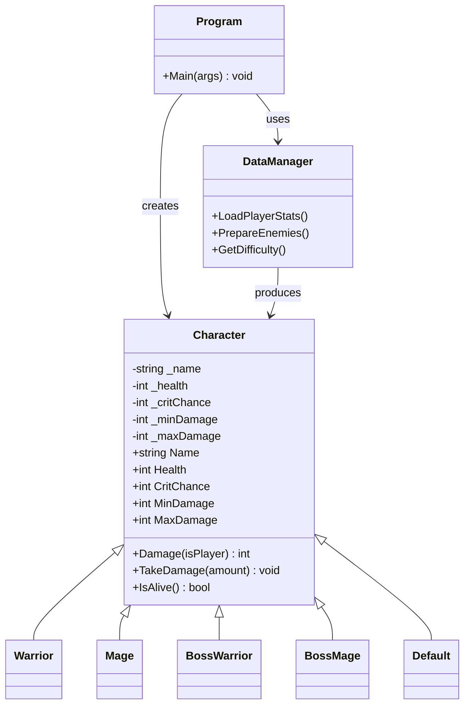
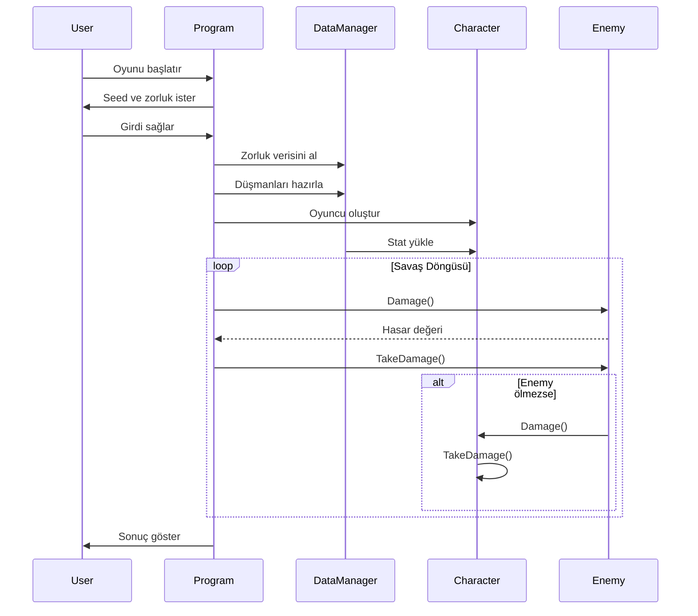

# 🛡️ OOP Tabanlı RPG Savaş Simülasyonu

## 📌 Proje Tanımı
Bu proje, terminal tabanlı bir RPG savaş simülasyonudur. Amaç, Nesne Yönelimli Programlama (OOP) prensiplerini gerçekçi bir senaryo üzerinde uygulamaktır.

Sistem veri odaklı (data-driven) çalışır; karakter ve zorluk verileri dış kaynaklardan (JSON) dinamik olarak yüklenir.

---

## 🏗️ Sınıflar ve İlişkileri

### 🔹 Character (Abstract Base Class)
Tüm karakterlerin temelini oluşturur.

- İsim, can, kritik şansı ve hasar aralığı içerir  
- Hasar verme ve hasar alma davranışlarını yönetir  
- Soyuttur, doğrudan örneklenmez  

---

### 🔹 Warrior & Mage
Oyuncu karakterlerini temsil eder.  
`Character` sınıfından türetilmişlerdir.

---

### 🔹 BossWarrior & BossMage
Düşman karakterlerdir.  
Oyuncu sınıflarıyla aynı yapıyı paylaşırlar ancak farklı veri setleri ile çalışırlar.

---

### 🔹 Default
Tanımsız durumlar için kullanılan fallback karakter sınıfıdır.

---

### 🔹 DataManager
Veri katmanını yönetir.

- JSON verilerini okur  
- Karakter istatistiklerini yükler  
- Zorluk ve düşman dalgalarını oluşturur  

---

### 🔹 Program
Uygulamanın giriş noktasıdır.

- Seed üretimi  
- Oyuncu oluşturma  
- Oyun döngüsünü yönetme  

---

## 🔗 Sınıflar Arası İlişkiler

- Tüm karakterler `Character` sınıfından türetilir (**Inheritance**)  
- Alt sınıflar aynı metotları farklı şekillerde kullanabilir (**Polymorphism**)  
- `Program`, diğer sınıfları kullanarak sistemi yönetir (**Composition**)  
- `DataManager`, veri sağlayıcı olarak çalışır  

---

## 🧠 Kullanılan OOP Kavramları

### ✔️ Encapsulation
Veriler private alanlarda tutulur ve property ile kontrol edilir:

```csharp
private int _health;
public int Health { get => _health; set => _health = Math.Max(0, value); }
```

---

### ✔️ Inheritance

```csharp
public class Warrior : Character
```

---

### ✔️ Polymorphism

```csharp
public virtual int Damage(bool isPlayer = false)
```

---

### ✔️ Abstraction
Oyun döngüsü sadece:
- `Damage()`
- `TakeDamage()`

metotlarını kullanır.

---

## ⚙️ Teknik Özellikler

- Seed sistemi ile deterministik oyun  
- Static Random kullanımı (performans)  
- Veri odaklı mimari  
- Turn-based savaş sistemi  

---

## 📊 UML Sınıf Diyagramı



---

## 🔄 Sequence Diagram (Oyun Akışı)



---

## 🎯 Sonuç

Bu proje:

- OOP prensiplerini gerçek bir senaryoda uygular  
- Modüler ve genişletilebilir bir yapı sunar  
- Veri odaklı tasarım ile esnekliği artırır  

Akademik olarak, sınıflar arası ilişkiler mantıklı şekilde kurulmuş ve her sınıfa sistem içinde belirli bir sorumluluk verilmiştir.